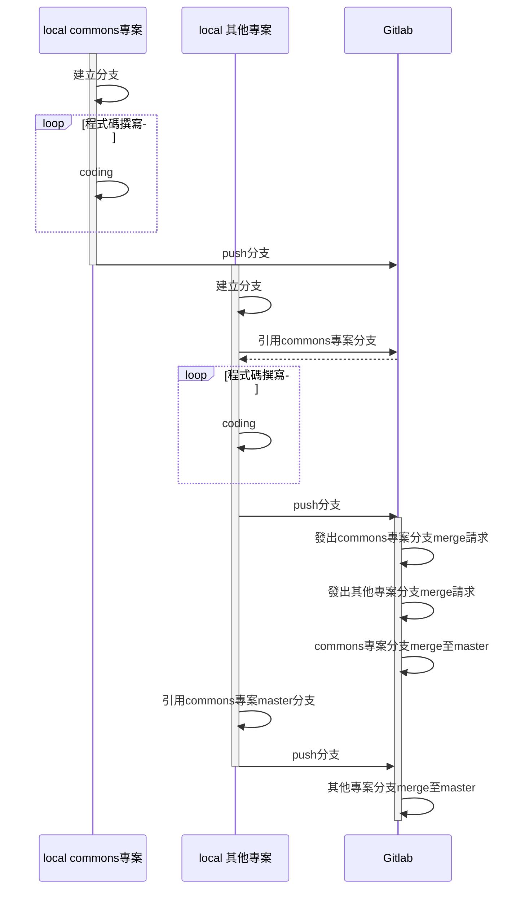

# commons 說明

- [安裝](#安裝)
- [操作說明](#操作說明)
- [開發需求軟體](#開發需求軟體)
- [基礎教學](#基礎教學)
- [端點說明](#端點說明)
  - [撰寫規則](#撰寫規則)
- [套件說明](#套件說明)
  - [util/convert](#utilconvert)
  - [util/mail](#utilmail)
  - [util/math](#utilmath)
  - [util/strings](#utilstrings)

## 安裝

初次安裝commons專案時，請於終端機執行`git config --global -l`，
確認是否有`url.ssh://git@gitlab.kenda.com.tw:4222.insteadof=https://gitlab.kenda.com.tw`此一設定，
若無請執行`git config --global "url.ssh://git@gitlab.kenda.com.tw:4222".insteadOf "https://gitlab.kenda.com.tw"`，
即可使用`go get`功能安裝commons專案。

安裝最新版本:`go get gitlab.kenda.com.tw/kenda/commons/v2`。

安裝特定分支:`go get gitlab.kenda.com.tw/kenda/commons/v2@branch_name`。

## 操作說明

第一次從gitlab clone commons專案後，請先於專案目錄下執行`go generate .`，以利程式安裝相關執行檔。
請確保golang workspace的bin資料夾有設定於PATH環境變數。

備註: workspace 於Windows作業系統預設為`%USERPROFILE%\go`，Unix作業系統預設為`$HOME/go`，也可利用GOPATH環境變數設定偏好的workspace路徑。

### 專案撰寫流程



## 開發需求軟體

Windows

- go 安裝
  1. 請參考 [go-golang專案](https://gitlab.kenda.com.tw/gogogo/go-golang#%E5%AE%89%E8%A3%9D)。
- Protocol Buffers安裝
  1. 請參考 [go-protobuf wiki](https://gitlab.kenda.com.tw/gogogo/go-protobuf/wikis/Install/00-Install#%E5%AE%89%E8%A3%9D)，go generator 安裝請參考下面第二步驟。
  2. 於專案路徑執行`go generate .`以便安裝相關 gRPC go generator。

## 基礎教學

- GO語言: [go-golang](https://gitlab.kenda.com.tw/gogogo/go-golang/blob/master/README.md)
- Protocol-Buffers: [go-protobuf](https://gitlab.kenda.com.tw/gogogo/go-protobuf/wikis/home)

## 端點說明

- [撰寫規則](#撰寫規則)

服務端點定義於proto檔(路徑為./src/proto/大系統別/服務別)，大系統別指DM系統或MES系統，服務別指大系統底下的服務。
proto檔定義完畢後，請開啟ternimal或cmd，於專案目錄執行`go generate ./src/proto/大系統別/服務別`，即可產生相關檔案。

如果想了解原理請詳看以下:

 1. go generate說明: [官方說明\(英文\)](https://golang.org/pkg/cmd/go/internal/generate/); [網友文章\(簡體中文\)](https://www.jianshu.com/p/a866147021da)
 2. generate gRPC程式說明: [官方說明\(英文\)](https://grpc.io/docs/quickstart/go/#generate-grpc-code)

 註: 若需使用pb.go中json、protobuf以外的tag時，需在欄位後方加入gogoproto.moretags，並使用`--gogo_out`作為 generator，詳細請參考 [link](https://gitlab.kenda.com.tw/kenda/commons/tree/master/src/proto/dm/rs#generate-%E4%BE%8B%E5%AD%90)。

### 撰寫規則

1. 檔案劃分: 以功能別區分。
2. proto檔名格式: 小蛇形[^1]。
3. proto專案根目錄: ./src/proto。
5. proto版本: proto3。
6. package定義: proto.${proto_path}, 每個資料夾以`.`符號分隔。
7. go_package定義: gitlab.kenda.com.tw/kenda/commons/v2/proto/golang/${proto_path}。
8. message: 大駝峰[^2]。
9. message欄位: 小蛇形。
10. enum命名格式: 大駝峰。
11. enum欄位: 大蛇形[^3]。
12. enum預設值命名([EBNF](https://zh.wikipedia.org/wiki/%E6%89%A9%E5%B1%95%E5%B7%B4%E7%A7%91%E6%96%AF%E8%8C%83%E5%BC%8F)): enum_default_name = [ { ( parent_messase_name | parent_enum_name ), "\_" } ], enum_name, "\_UNSPECIFIED" ;
13. 註解位置: 定義的上方。
14. 撰寫proto檔時，如果要表示該message是用作於請求或回應，請分別在結尾使用Request或Reply，如可作為請求和回應，則不需註明。
15. 撰寫proto檔時，請將rpc service定義於service.proto檔。
16. 撰寫proto檔時，定義http URL規則為: `/服務別/功能名`，並以小駝峰[^4]命名。
17. 撰寫端點(go檔)時，請將相同功能的端點定義於同一go檔。
18. 撰寫proto檔時，請依照下面命名規則說明撰寫service端點：

| 功能說明  | rpc命名方式 | HTTP請求 | URI命名規則 | 備註 |
|:-------- |:------------|:--------:|:---------- |:---- |
| 查詢單筆資料 | 以Get開頭, 例如`Get`Something | GET | /服務別/something | 因特殊原因, 有關ERP系統端點, HTTP請求改為POST, 且URI命名規則為 /服務別/something/get |
| 查詢多筆資料 | 以List開頭並用複數型態, 例如`List`Something`s` | GET | /服務別/somethings | 因特殊原因, 有關ERP系統端點, HTTP請求改為POST, 且URI命名規則為 /服務別/somethings/get |
| 新增單筆資料 | 以Create開頭, 例如`Create`Something | POST | /服務別/something | |
| 修改功能端點 | 以Update開頭, 例如`Update`Something | PUT | /服務別/something | |
| 刪除功能端點 | 以Delete開頭, 例如`Delete`Something | DELETE | /服務別/something/{key} | |
| 查詢並lock資料 | 同單/多筆, 以AndLock結尾, 例如GetSomething`AndLock` | GET | /服務別/something/lock | 因特殊原因, 有關ERP系統端點, HTTP請求改為POST, 且URI命名規則為 /服務別/something/lock/get |
| unlock資料 | 以Unlock開頭, 例如`Unlock`Something | PUT | /服務別/something/unlock | |

備註:

- 若此專案proto檔引用其他此專案proto檔時, 在generate proto時, 需加上`-I=. -I=${以相對路徑指向proto專案根目錄的父目錄}`。
- 若需generate此專案proto檔時, 需設定paths flag為source_relative. e.g. `--go_out=paths=source_relative:${output_path}`。

#### 範例

情境：建立一"圖形"系統(Graphics)，該系統包含以下端點

1. 新增圓形 (request:*圓心XY座標*, *半徑*; reply:*id*)
2. 取得圓形 (request:*id*; reply:*圓心XY座標*, *半徑*)
3. 取得圓形面積 (request:*id*; reply:*面積*)
4. 修改圓形 (request:*id*, *圓心XY座標*, *半徑*; reply:*none*)
5. 刪除圓形 (request:*id*; reply:*none*)
6. 新增矩形 (request:*中心點XY座標*, *長*, *寬*; reply:*id*)
7. 取得矩形 (request:*id*; reply:*中心點XY座標*, *長*, *寬*)
8. 取得矩形面積 (request:*id*; reply:*面積*)
9. 修改矩形 (request:*id*, *中心點XY座標*, *長*, *寬*; reply:*none*)
10. 刪除矩形 (request:*id*; reply:*none*)

此專案go module名稱:gitlab.kenda.com.tw/example/graphics

預計檔案結構如下：

```txt
├── proto
│   └── golang
│       └── graphics
│           ├── graph.pb.go
│           ├── coordinate.pb.go
│           ├── circle.pb.go
│           ├── rectangle.pb.go
│           ├── service.pb.go
│           └── service.pb.gw.go
├── src
│   └── proto
│       └── graphics
│           ├── graph.proto
│           ├── coordinate.proto
│           ├── circle.proto
│           ├── rectangle.proto
│           ├── service.proto
│           └── protogen.go
├── go.mod
└── main.go
```

./src/proto/graphics目錄所有檔案定義如下:

```protobuf
// ./src/proto/graphics/graph.proto 檔案內容
syntax = "proto3";
package proto.graphics;
option go_package = "gitlab.kenda.com.tw/example/graphics/proto/golang/graphics";

message Graph {
  enum Type {
    GRAPH_TYPE_UNSPECIFIED = 0;
    CIRCLE                 = 1;
    RECTANGLE              = 2;
  }

  string id   = 1;
  Type   type = 2;
}
message Area {
  float value = 1;
}
```

```protobuf
// ./src/proto/graphics/coordinate.proto 檔案內容
syntax = "proto3";
package proto.graphics;
option go_package = "gitlab.kenda.com.tw/example/graphics/proto/golang/graphics";

message Coordinate {
  string x = 1;
  string y = 2;
}
```

```protobuf
// ./src/proto/graphics/circle.proto 檔案內容
syntax = "proto3";
package proto.graphics;
option go_package = "gitlab.kenda.com.tw/example/graphics/proto/golang/graphics";

import "proto/graphics/coordinate.proto";

message Circle {
  proto.graphics.Coordinate center = 1;
  float                     radius = 2;
}
message SpecificCircle {
  string id       = 1;
  Circle property = 2;
}
```

```protobuf
// ./src/proto/graphics/rectangle.proto 檔案內容
syntax = "proto3";
package proto.graphics;
option go_package = "gitlab.kenda.com.tw/example/graphics/proto/golang/graphics";

import "proto/graphics/coordinate.proto";

message Rectangle {
  proto.graphics.Coordinate center = 1;
  float                     width  = 2;
  float                     height = 3;
}
message SpecificRectangle {
  string    id       = 1;
  Rectangle property = 2;
}
```

```protobuf
// ./src/proto/graphics/service.proto 檔案內容
syntax = "proto3";
package proto.graphics;
option go_package = "gitlab.kenda.com.tw/example/graphics/proto/golang/graphics";

import "google/api/annotations.proto";
import "google/protobuf/empty.proto";
import "proto/graphics/graph.proto";
import "proto/graphics/circle.proto";
import "proto/graphics/rectangle.proto";

service Graphics {
  rpc AddCircle(proto.graphics.Circle) returns (proto.graphics.Graph) {
    option (google.api.http) = {
      post : "/graphics/circle"
      body : "*"
    };
  }
  rpc GetCircle(proto.graphics.Graph) returns (proto.graphics.Circle) {
    option (google.api.http) = {
      post : "/graphics/circle/get"
      body : "*"
    };
  }
  rpc GetCircleArea(proto.graphics.Graph) returns (proto.graphics.Area) {
    option (google.api.http) = {
      post : "/graphics/circle/area/get"
      body : "*"
    };
  }
  rpc UpdateCircle(proto.graphics.SpecificCircle) returns (google.protobuf.Empty) {
    option (google.api.http) = {
      put : "/graphics/circle"
      body : "*"
    };
  }
  rpc DeleteCircle(proto.graphics.Graph) returns (google.protobuf.Empty) {
    option (google.api.http) = {
      delete : "/graphics/circle/{id}"
    };
  }

  rpc AddRectangle(proto.graphics.Rectangle) returns (proto.graphics.Graph) {
    option (google.api.http) = {
      post : "/graphics/rectangle"
      body : "*"
    };
  }
  rpc GetRectangle(proto.graphics.Graph) returns (proto.graphics.Rectangle) {
    option (google.api.http) = {
      post : "/graphics/rectangle/get"
      body : "*"
    };
  }
  rpc GetRectangleArea(proto.graphics.Graph) returns (proto.graphics.Area) {
    option (google.api.http) = {
      post : "/graphics/rectangle/area/get"
      body : "*"
    };
  }
  rpc UpdateRectangle(proto.graphics.SpecificRectangle) returns (google.protobuf.Empty) {
    option (google.api.http) = {
      put : "/graphics/rectangle"
      body : "*"
    };
  }
  rpc DeleteRectangle(proto.graphics.Graph) returns (google.protobuf.Empty) {
    option (google.api.http) = {
      delete : "/graphics/rectangle/{id}"
    };
  }
}
```

```go
// ./src/proto/graphics/protogen.go 檔案內容
package graphics

//go:generate protoc --go_out=paths=source_relative:../../../proto/golang/graphics graph.proto
//go:generate protoc --go_out=paths=source_relative:../../../proto/golang/graphics coordinate.proto
//go:generate protoc -I=. -I=../.. --go_out=paths=source_relative:../../../proto/golang/graphics circle.proto
//go:generate protoc -I=. -I=../.. --go_out=paths=source_relative:../../../proto/golang/graphics rectangle.proto

//go:generate protoc -I=. -I=../.. -I=$GOPATH/pkg/mod/github.com/grpc-ecosystem/grpc-gateway@v1.6.2/third_party/googleapis --go_out=paths=source_relative,plugins=grpc:../../../proto/golang/graphics service.proto
//go:generate protoc -I=. -I=../.. -I=$GOPATH/pkg/mod/github.com/grpc-ecosystem/grpc-gateway@v1.6.2/third_party/googleapis --grpc-gateway_out=paths=source_relative,logtostderr=true:../../../proto/golang/graphics service.proto

//go:generate go vet ../../../...

```

於專案根目錄執行`go generate ./src/proto/graphics`指令後, 即可產生相對應pb.go與pb.gw.go。

## 套件說明

### util/convert

convert套件提供資料型態轉換功能。

各功能說明請參考其註解文件。

### util/mail

依據註冊的代理器提供發送信件功能, 目前提供兩種代理器:

- DefaultAgent
- WriterAgent

註冊代理器及操作方式請參閱[agent_test.go](https://gitlab.kenda.com.tw/kenda/commons/blob/master/util/mail/agent_test.go)。

#### DefaultAgent

寄件人固定為`kenda@kenda.com.tw`, 若有設定DevelopmentMode(developer), 信件將只發送給developer。

#### WriterAgent

僅會將信件藉由`io.Writer`輸出, 不會發送信件。

### util/math

math套件提供常用數學運算或資料型態最大最小值。

各功能說明請參考其註解文件。

### util/strings

strings套件提供`Builder struct`，功能同`strings.Builder`，但多一方法`WriteStrings(...string)`。

[^1]: 小蛇形:全小寫英文, 以`_`符號分隔
[^2]: 大駝峰:第一個單字開頭為大寫英文, 其他單字開頭為大寫
[^3]: 大蛇形:全大寫英文, 以`_`符號分隔
[^4]: 小駝峰:第一個單字開頭為小寫英文, 其他單字開頭為大寫
